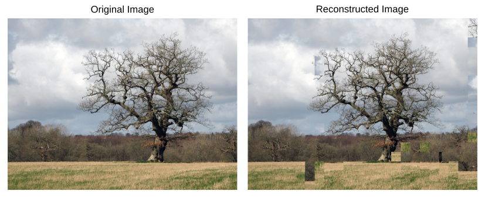

# Solver for jigsaw puzzles

[](https://app.circleci.com/pipelines/github/JulienNonin/jigsaw-puzzle-solver/)

Chances are you've spent afternoons moving these little square pieces around to solve a jigsaw puzzle! This Python library aims at solving jigsaw puzzles with square pieces. This greedy solver based on [*Pomeranz et al.*](https://www.cs.bgu.ac.il/~ben-shahar/Publications/2011-Pomeranz_Shemesh_and_Ben_Shahar-A_Fully_Automated_Greedy_Square_Jigsaw_Puzzle_Solver.pdf) is fully automated and requires no manually provided hints.



## Installation
First clone the project
```
git clone https://github.com/JulienNonin/jigsaw-puzzle-solver.git
cd jigsaw-puzzle-solver
```
This project runs on Python 3.6+. and depends on the following standard Python libraries:
* [NumPy](https://numpy.org/), 
* [Matplotlib](https://matplotlib.org/),
* [scikit-image](https://scikit-image.org/)


To install these requirements, use the following command:
```
pip install -r requirements.txt
```

Tests are located inside the `tests/` folder and are Run [`unittest`](https://docs.python.org/3/library/unittest.html#module-unittest) 

```
python -m unittest discover -p *_test.py
```

## How to use it

```python
import jigsolver as jg
from jigsolver.pomeranz_solver.solver import solve
import matplotlib.pyplot as plt

# Create the Puzzle
img = plt.imread("img/eiffel.jpg")[:,:,:3]
puzzle = jg.Puzzle(img, jg.puzzle.nb_rows_and_columns((6, 9)))

# Solve the Puzzle
solve(puzzle)
puzzle.display()
```

Further examples can be found in the notebook `sandbox.ipynb`.

[](https://colab.research.google.com/github/JulienNonin/jigsaw-puzzle-solver/blob/master/sandbox.ipynb).

## Contribution
Contributors:
* [Rony Abecidan](https://github.com/RonyAbecidan/)
* [Maxence Giraud](https://github.com/MaxenceGiraud/)
* [Zhengyang Lan](https://github.com/LANZhengyang)
* [Julien Nonin](https://github.com/JulienNonin)

See also [commit naming conventions](docs/CONTRIBUTING.md)


## Todo 
- [x] Implement Puzzle
- [x] Add the Compatibility matrix
- [x] Implement Placer 
- [x] Implement Segmenter
- [x] Implement Shifter
- [ ] Clean
- [ ] Fix border rolling behaviour
